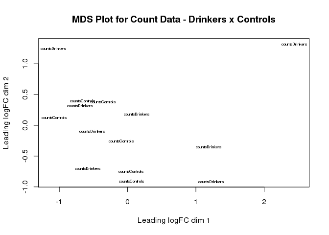
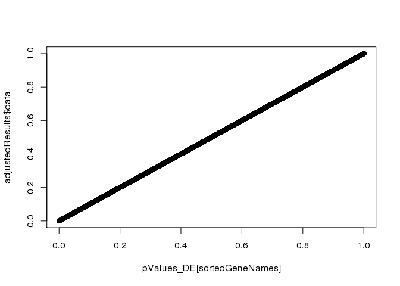
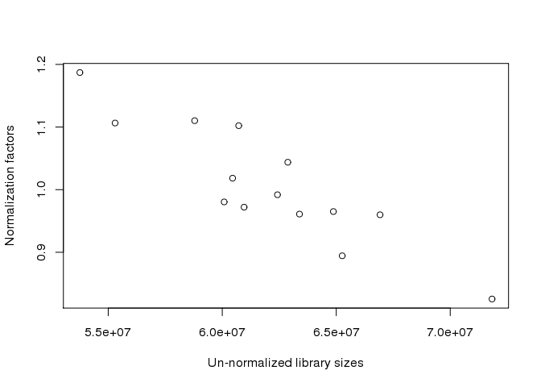
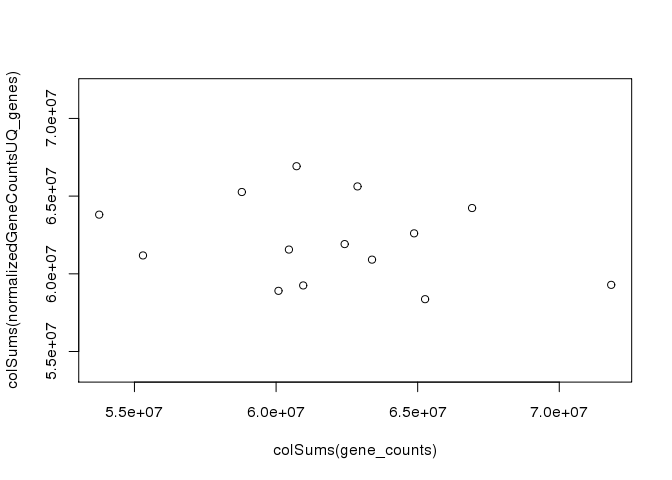

Normalization/Selection of reads, and DE/DV analysis RNA160728RH - cohort 10 (MacaM alignment)
================

Description
-----------

Through this script we normalize exons and genes reads from RNA-Seq, selecting those with &gt; 1 CPM and searching for gene differential expression (DE) and differential variability (DV)

#### Load libraries

``` r
library(matrixStats)
library(edgeR)
library(WGCNA)
library(biomaRt)
library(plotrix)

library(foreach)
library(doMC)
registerDoMC()
library(proxy)
library(sgof)
library(multtest)
library(plyr)

getDoParWorkers()
```

    ## [1] 4

``` r
options(cores = 6)
getDoParWorkers()
```

    ## [1] 6

``` r
# setwd('/lawrencedata/ongoing_analyses/RNA160728RH/160908_D00735_0143_ACA7N4ANXX/RNA160728RH/')

source("MacaM/scripts/functionDefinitions.R")
try(dir.create("MacaM/analysis/resultsCoexpr_MacaM"), 
    silent = F)
try(dir.create("MacaM/analysis/figuresCoexpr_MacaM"), 
    silent = F)
try(dir.create("MacaM/analysis/resultsCoSplicEx_MacaM"), 
    silent = F)
try(dir.create("MacaM/analysis/figuresCoSplicEx_MacaM"), 
    silent = F)
```

#### Data preparation

``` r
# read raw data (counts generated with bedtools
# multiBamCov)
exonReadsRaw = read.table("MacaM/data/RNA160728RH_Rh_coverage_splitoption_stranded_oppositeDirection.txt", 
    header = F, sep = "\t", stringsAsFactors = F)

# Change column 4 name to 'gene_sym'
names(exonReadsRaw)[4] <- "gene_sym"

# Combine the chromosome number, start location,
# and gene symbol to create a unique id column for
# each exon
exonReadsRaw$exon <- paste(exonReadsRaw$V1, exonReadsRaw$V2, 
    exonReadsRaw$V3, exonReadsRaw$gene_sym, sep = "_")

# Sample 10210 was listed twice (everything in both
# columns are exactly the same), so let's fix that
# by removing one of those columns.
exonReadsRaw <- exonReadsRaw[, -9]

# Create a data frame with gene symbol and exon
# read counts
exon_counts <- exonReadsRaw[, 7:21]
exon_counts <- cbind(exonReadsRaw$gene_sym, exon_counts)

# Calculate the total counts for each gene for each
# sample
gene_counts <- ddply(exon_counts, 1, numcolwise(sum))

# Change the row names of the exon data frame to
# the exon unique ids (created above)
rownames(exon_counts) <- exon_counts$exon

# Remove the gene symbol and exon id columns from
# the exon data frame
exon_counts <- exon_counts[, 2:15]

# Change the row names of the gene data frame to
# the gene symbols
names(gene_counts)[1] <- "gene_sym"
rownames(gene_counts) <- gene_counts$gene_sym

# Remove the gene symbol column from the gene data
# frame
gene_counts <- gene_counts[, 2:15]

# Load sample names in the order they are in the
# coverage file
samples <- read.table("MacaM/scripts/bam_files.txt", 
    header = F, stringsAsFactors = F)

# Again, as done above, need to remove sample 10210
# which is listed twice
samples <- samples[, -3]

names(gene_counts) <- samples[1, ]
names(exon_counts) <- samples[1, ]

write.table(gene_counts, "MacaM/analysis/RNA160728RH_MacaM_gene_reads_not_normalized.txt", 
    sep = "\t", quote = F, col.names = T, row.names = T)
write.table(exon_counts, "MacaM/analysis/RNA160728RH_MacaM_exon_reads_not_normalized.txt", 
    sep = "\t", quote = F, col.names = T, row.names = T)
save.image("MacaM/data/Read_Counts_and_Normalization_MacaM.RData")
```

#### If you just need the normalized counts:

-   calculate edgeR normalization factors and normalize the data - use all data not just selected
-   these normalized data are not used for the DE analysis since edgeR's differential expression algorithm (used further down in this script) normalizes the data when calculating the DE

``` r
UQnormFactors_exons = calcNormFactors(exon_counts, 
    method = c("upperquartile"))
UQnormFactors_genes = calcNormFactors(gene_counts, 
    method = c("upperquartile"))

effectiveLibrarySizes_exons = UQnormFactors_exons * 
    colSums(exon_counts)
effectiveLibrarySizes_genes = UQnormFactors_genes * 
    colSums(gene_counts)

meanEffLibSize_exons = mean(effectiveLibrarySizes_exons)
meanEffLibSize_genes = mean(effectiveLibrarySizes_genes)

countNormFactor_exons = meanEffLibSize_exons/effectiveLibrarySizes_exons
countNormFactor_genes = meanEffLibSize_genes/effectiveLibrarySizes_genes

normalizedGeneCountsUQ_exons = 0 * exon_counts
normalizedGeneCountsUQ_genes = 0 * gene_counts

for (sample in 1:dim(normalizedGeneCountsUQ_exons)[2]) {
    normalizedGeneCountsUQ_exons[, sample] = exon_counts[, 
        sample] * countNormFactor_exons[sample]
}

for (sample in 1:dim(normalizedGeneCountsUQ_genes)[2]) {
    normalizedGeneCountsUQ_genes[, sample] = gene_counts[, 
        sample] * countNormFactor_genes[sample]
}

write.table(normalizedGeneCountsUQ_exons, "MacaM/analysis/RNA160728RH_MacaM_exon_reads_UQNormalized.txt", 
    sep = "\t", quote = F, col.names = T, row.names = T)
write.table(normalizedGeneCountsUQ_genes, "MacaM/analysis/RNA160728RH_MacaM_gene_reads_UQNormalized.txt", 
    sep = "\t", quote = F, col.names = T, row.names = T)
save.image("MacaM/data/Read_Counts_and_Normalization_MacaM.RData")
```

#### If you need to calculate differential expression:

``` r
load("MacaM/data/Read_Counts_and_Normalization_MacaM.RData")

# read sample info (the sample file contains two
# columns: the sample id, and the corresponding
# phenotype)
sampleKey = read.table("MacaM/data/rhesus_phenotype.txt", 
    header = F, sep = "\t")
sampleKey = as.data.frame(t(sampleKey[, 2:15]))

samplesDrinkers <- subset(sampleKey, sampleKey$V2 == 
    "Drinker")
samplesControls <- subset(sampleKey, sampleKey$V2 != 
    "Drinker")

# this cleans up the subsets of the levels that
# remained from sampleKey to avoid further
# headaches
samplesDrinkers <- levels(droplevels(samplesDrinkers$V1))
samplesControls <- levels(droplevels(samplesControls$V1))

countsDrinkers = gene_counts[, substring(samples, 16, 
    20) %in% samplesDrinkers]
countsControls = gene_counts[, substring(samples, 16, 
    20) %in% samplesControls]

save(samplesControls, samplesDrinkers, countsControls, 
    countsDrinkers, sampleKey, file = "DE_MacaM.RData")

# divide the data in different groups and perform
# DE with edgeR
groupSelection = c(rep("countsDrinkers", dim(countsDrinkers)[2]), 
    rep("countsControls", dim(countsControls)[2]))
groupSelection = factor(groupSelection)

d = DGEList(counts = cbind(countsDrinkers, countsControls), 
    group = groupSelection)
d <- estimateCommonDisp(d)
d <- estimateTagwiseDisp(d)
de.tgw <- exactTest(d, dispersion = "tagwise")
```

#### Just as a sanity check I looked at the MDS plot to verify if I should expect sample segregation indeed, clustering, or any sample outlier



#### Going further with the Differential Expression/Variability analysis

``` r
# use sgof package for multiple comparison
# correction results from sgof come out sorted but
# un-named (!!!!) so the original pvalues and
# geneNames need to be sorted

pValues_DE = de.tgw$table$PValue
geneNames <- rownames(de.tgw$table)
names(pValues_DE) = geneNames

sortIndexes = sort.int(pValues_DE, decreasing = F, 
    index.return = T)$ix
sortedGeneNames = geneNames[sortIndexes]

adjustedResults <- SGoF(u = pValues_DE)
```
summary(adjustedResults)
```

    ## Call:
    ## SGoF(u = pValues_DE)
    ## 
    ## Parameters: 
    ## alpha= 0.05 
    ## gamma= 0.05

    ## $Rejections
    ## [1] 0
    ## 
    ## $FDR
    ## [1] 0
    ## 
    ## $Adjusted.pvalues
    ## 
    ##  >gamma <=gamma 
    ##   15923       1 
    ## 
    ## attr(,"class")
    ## [1] "summary.SGoF"

``` r
sortedAdjustedPvals_DE = adjustedResults$Adjusted.pvalues
names(sortedAdjustedPvals_DE) = sortedGeneNames

fileConnSummary <- file("resultsCoexpr_MacaM/SummaryResultsCoexpr.txt", 
    open = "wt")

writeLines(paste("Number of genes with FDR < 0.05: ", 
    sum(sortedAdjustedPvals_DE < 0.05), sep = " "), 
    fileConnSummary)
close(fileConnSummary)

# some sanity checks
plot(pValues_DE[sortedGeneNames], adjustedResults$data)  # should be straight line
```



``` r
# from the old script (I did this to compare to the
# results from SGoF; no difference)
de.calls <- decideTestsDGE(de.tgw, p = 0.05, adjust.method = "fdr")  # returns 0 de calls; 104 if no adjustment
sum(de.calls)
```

    ## [1] 0

``` r
resultsDEtotal = cbind(de.tgw$table, de.calls)

# verify that smaller libraries are multiplied by
# bigger normalization factors
plot(colSums(gene_counts), countNormFactor_genes, xlab = "Un-normalized library sizes", 
    ylab = "Normalization factors")
```



``` r
# plot original library sizes versus normalized
# range of data much smaller in normalized data
xylim = c(min(colSums(gene_counts), colSums(normalizedGeneCountsUQ_genes)), 
    max(colSums(gene_counts), colSums(normalizedGeneCountsUQ_genes)))
plot(colSums(gene_counts), colSums(normalizedGeneCountsUQ_genes), 
    xlim = xylim, ylim = xylim)
```



``` r
## standard deviation of normalized libraries should
## me much smaller
sd(colSums(gene_counts))
```

    ## [1] 4595921

``` r
sd(colSums(normalizedGeneCountsUQ_genes))
```

    ## [1] 2719950

``` r
# select genes with logCPM > 0 (equivalent to
# CPM>1)

geneNamesHighCPM = geneNames[de.tgw$table[, "logCPM"] > 
    0]
geneCountsHighCPM = normalizedGeneCountsUQ_genes[geneNamesHighCPM, 
    ]

meanCountsDrinkers = rowMeans(countsDrinkers[geneNamesHighCPM, 
    ])
meanCountsControls = rowMeans(countsControls[geneNamesHighCPM, 
    ])

sdCountsDrinkers = apply(countsDrinkers[geneNamesHighCPM, 
    ], 1, sd)
sdCountsControls = apply(countsControls[geneNamesHighCPM, 
    ], 1, sd)

# find differentially variable genes

pvalVar = rep(1, length(geneNamesHighCPM))
names(pvalVar) = geneNamesHighCPM

for (gene in geneNamesHighCPM) {
    pvalVar[gene] = var.test(x = t(countsDrinkers[gene, 
        ]), y = t(countsControls[gene, ]))$p.value
}

pvalVar[is.na(pvalVar)] = 1

pValues = pvalVar
names(pValues) = geneNamesHighCPM

sortIndexes = sort.int(pValues, decreasing = F, index.return = T)$ix
sortedGeneNames = geneNamesHighCPM[sortIndexes]

adjustedResults <- SGoF(u = pValues)
summary(adjustedResults)
```

    ## Call:
    ## SGoF(u = pValues)
    ## 
    ## Parameters: 
    ## alpha= 0.05 
    ## gamma= 0.05

    ## $Rejections
    ## [1] 457
    ## 
    ## $FDR
    ## [1] 0.2894
    ## 
    ## $Adjusted.pvalues
    ## 
    ##  >gamma <=gamma 
    ##   12204     459 
    ## 
    ## attr(,"class")
    ## [1] "summary.SGoF"

``` r
sortedAdjustedPvals_DV = adjustedResults$Adjusted.pvalues
names(sortedAdjustedPvals_DV) = sortedGeneNames

fileConnSummary <- file("resultsCoexpr_MacaM/SummaryResultsCoexpr.txt", 
    open = "at")

writeLines(paste("Number of genes with DV < FDR=0.05: ", 
    sum(sortedAdjustedPvals_DV < 0.05), sep = " "), 
    fileConnSummary)
close(fileConnSummary)

geneNamesDE = sortedGeneNames[sortedAdjustedPvals_DE < 
    0.05]
geneNamesDV = sortedGeneNames[sortedAdjustedPvals_DV < 
    0.05]

write.csv(geneNamesDE, file = "resultsCoexpr_MacaM/geneNamesDE.csv")
write.csv(geneNamesDV, file = "resultsCoexpr_MacaM/geneNamesDV.csv")

# Sanity check
setdiff(geneNamesHighCPM, geneNames)
```

    ## character(0)

#### Preparing DE/DV results to be written to file

``` r
results_highCPMgenes = cbind(de.tgw$table[geneNamesHighCPM, 
    ], meanCountsControls[geneNamesHighCPM], meanCountsDrinkers[geneNamesHighCPM], 
    pValues_DE[geneNamesHighCPM], sortedAdjustedPvals_DE[geneNamesHighCPM], 
    sdCountsControls[geneNamesHighCPM], sdCountsDrinkers[geneNamesHighCPM], 
    pvalVar, sortedAdjustedPvals_DV[geneNamesHighCPM])
results_highCPMgenes = round(results_highCPMgenes, 
    3)
colnames(results_highCPMgenes) = c(colnames(de.tgw$table), 
    c("mean counts controls", "mean counts drinkers", 
        " p val DE", " adj p DE", "sd controls", "sd drinkers", 
        "p val DV", "adj p val DV"))
rownames(results_highCPMgenes) = geneNamesHighCPM

write.csv(results_highCPMgenes, file = "resultsCoexpr_MacaM/resultsDEDV_highCPM_MacaM.csv")
```
